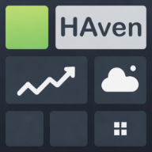
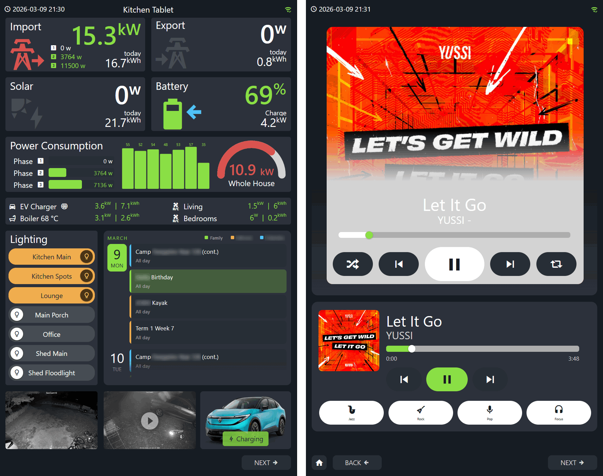
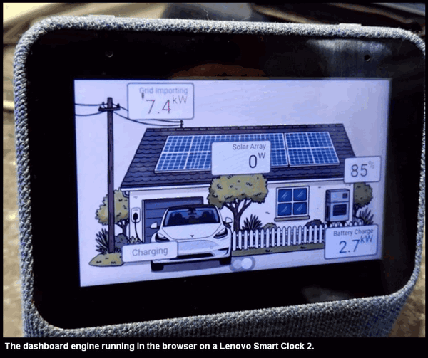
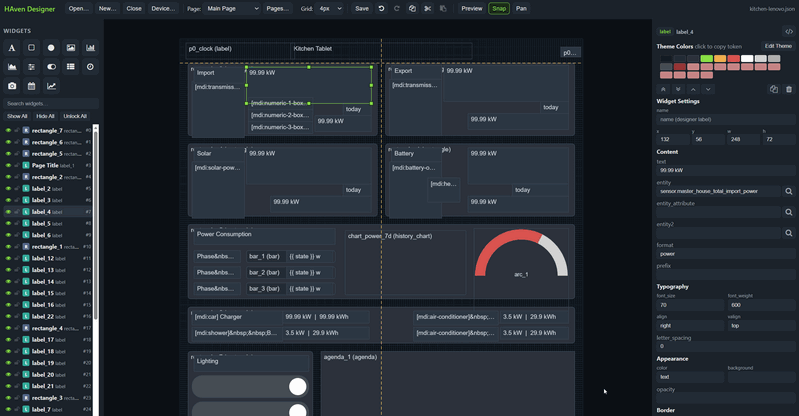

#  HAven

### *A lightweight Home Assistant dashboard for screens that Lovelace left behind*

An old iPad gathering dust... That sluggish Android tablet mounted on the kitchen wall... The Fire HD you picked up for $30... HAven gives them a second life as always-on Home Assistant displays. No addons, no server-side code, no install. Just static files dropped into your HA `www/` folder and a browser that can open a URL.

Most dashboards flex and reflow to fit whatever screen they land on. HAven takes the opposite approach: a fixed canvas, absolute widget placement, and every element exactly where you put it. Design once at a specific resolution and HAven scales it to fill any screen. No responsive breakpoints, no layout surprises. Just a purpose-built display that looks exactly how you intended.

---

> [!NOTE]
> HAven is actively developed and should be considered a work in progress. Bugs are expected, and refactoring between releases may occasionally introduce breaking changes to config files or widget properties. Check the release notes before updating.
>
> Documentation is also a work in progress. Individual widget reference pages are not yet complete for all widget types.
>
> **Feature requests:** use [Discussions](https://github.com/TommySharpNZ/haven/discussions)
> **Bugs and questions:** use [Issues](https://github.com/TommySharpNZ/haven/issues)
>
> Feedback and contributions are very welcome.

---

## A note on AI-assisted development

The code in this project was written almost entirely with the help of AI (primarily Claude). I am not a hardcore software developer, I just dabble. I had a clear vision for what I wanted to build, and I used AI as the tool to get there. The result may not win any awards for elegant code architecture, but it is doing exactly what I designed it to do, on hardware that most dashboards have given up on.

If AI-generated code bothers you, that is a completely fair position to hold. There are plenty of other projects built by talented developers writing every line themselves, and you should use whatever fits your values. HAven exists because I could not have built it any other way on my own, and it works well to deliver my vision.

On the subject of "spaghetti code": yes the entire runtime is a single ~7000 line JavaScript file. That is a deliberate architectural choice, not really an oversight. HAven has no build process, no bundler, and no dependencies. It has to run on browsers from 2014 on cheap tablets and smart TVs, which rules out modern module syntax. A single file is the right tool for that job. Within that file the code hopefully follows consistent naming conventions, clear section headers, and a surgical update pattern that has been actively reviewed and tidied. If you see something that is genuinely hard to follow or could be cleaner, pull requests and constructive issues are welcome.

---

## Features

- **Zero server-side install:** copy files into HA's `www/` folder, done
- **Fixed canvas, pixel-perfect layouts:** design at any resolution, HAven scales to fit any screen
- **Config-driven:** everything defined in JSON, no code changes needed to build dashboards
- **Live HA data:** WebSocket connection with surgical DOM updates; only widgets bound to a changed entity update
- **15 widget types:** label, button, switch, slider, bar, arc, rectangle, image, camera, clock, scene, history chart, agenda, task, line
- **Conditional overrides:** any widget property can change based on entity state, attributes, or page, using ordered rules with AND/OR logic
- **Template expressions:** `{{ ... }}` in label text and color fields for calculated values
- **MDI icons bundled locally:** works fully offline, no CDN required
- **Multi-page with swipe navigation:** dot indicators, swipe gestures, persistent overlay page
- **Camera support:** MJPEG, snapshot, poster, and direct URL preview modes; fullscreen HLS stream on tap
- **Screensaver:** configurable idle timeout with optional bouncing text
- **`haven_command` event bus:** HA automations can trigger navigation, wake, dim, or speech on the device
- **Visual themes:** drop-in CSS theme files for scanlines, glow, fonts, and other visual effects without touching any dashboard config
- **Visual designer:** drag-and-drop editor at `designer.html` with live preview, undo/redo, and entity search

---

## Installation

1. Download the latest release from the [releases page](https://github.com/TommySharpNZ/haven/releases/latest) and unzip it
2. Copy the contents into a `haven/` folder inside your Home Assistant `/config/www/` directory
3. Access HAven at `http://your-ha-ip:8123/local/haven/index.html`

> HACS distribution is planned for a future release. See the Roadmap below.

> [!IMPORTANT]
> HAven files live in HA's `www/` folder, which is served without authentication. Device config files are readable by anyone who can reach your HA instance. **Do not leave tokens in device JSON files**, especially if your HA is remotely accessible. For best practice, use a dedicated non-admin HA user to generate tokens used in HAven. See [Credentials & Security](docs/getting-started.md#credentials--security) for the full details.

---

## Quick Start

1. Open `http://your-ha-ip:8123/local/haven/index.html?device=example`
2. Enter a Long-Lived Access Token when prompted
3. Edit `devices/example.json` or create your own device config

A graphical designer is available at `designer.html` on the same path. It requires Chrome or Edge over a HTTPS connection (Nabu Casa works perfectly).

---

## Documentation

| Document | Contents |
|----------|----------|
| [Getting Started](docs/getting-started.md) | Installation, first run, credentials, browser compatibility, troubleshooting |
| [Config Reference](docs/config-reference.md) | Device block, theme, pages, icons, internal entities, performance notes |
| [Widget Reference](docs/widgets.md) | All widget types with links to individual widget pages |
| [Actions](docs/actions.md) | Navigate, service calls, automations, value tokens, `haven_command` |
| [Conditional Overrides](docs/overrides.md) | Override syntax, condition sources, visibility, template expressions |
| [Designer Reference](docs/designer.md) | Canvas, properties panel, entity search, pages, theme editor, keyboard shortcuts |

---

## Widget Types

| Widget | Description |
|--------|-------------|
| `label` | Text display with live entity values, formatting, icons, and template expressions |
| `button` | Tappable button with entity-driven state styling and service actions |
| `switch` | Sliding toggle for any binary entity |
| `slider` | Draggable control for brightness, volume, cover position, and similar |
| `bar` | Horizontal progress bar with threshold-based colors |
| `arc` | Circular gauge with threshold colors and center label |
| `rectangle` | Filled rectangle for card backgrounds, overlays, and gradients |
| `image` | Static or entity-driven image with optional fullscreen tap |
| `camera` | Camera feed (MJPEG / snapshot / poster / direct URL) with fullscreen HLS stream |
| `clock` | Current time display, updates every second |
| `scene` | Option selector rendered as buttons, dropdown, or picker |
| `history_chart` | Bar chart from HA long-term statistics with optional fullscreen modal |
| `agenda` | Scrollable event list from one or more HA calendar entities |

---

## Roadmap

**Planned**
- [ ] HACS distribution: HAven does not fit HACS 2.x plugin or dashboard categories cleanly, as it is a standalone web app rather than a Lovelace resource. A companion `custom_components/haven` integration that registers HAven as a proper HA panel is the likely path forward.
- [ ] Flow dots widget: animated dots along a path for energy/power direction visuals
- [ ] Multi-action buttons: an `actions` array (alongside the existing single `action`) so one button tap can call multiple HA services in sequence. Each entry supports an optional `delay` (ms) for cases where a media player or other device needs a moment before accepting follow-up commands. Fully backwards compatible.
- [ ] Actions on image widgets: add `action` support so a tap can trigger navigation, a service call, or an automation instead of only opening the fullscreen overlay.
- [ ] Conditional actions: a `"type": "conditional"` action that picks which service to call based on the widget entity's current state or attribute. Uses the same condition syntax as overrides. Enables true toggle behaviour (mute/unmute, repeat mode cycling, etc.) from a single button without HA scripts or stacked widgets.

**Implemented**
- [x] All 13 widget types listed above
- [x] Conditional overrides with ordered rules, all/any logic, attribute and page sources
- [x] Template expressions in label text and color
- [x] `entity2` secondary entity binding
- [x] Multi-page navigation with swipe gestures and dot indicators
- [x] Page 0 persistent overlay
- [x] Screensaver with idle timeout and bouncing text
- [x] `haven_command` event bus (navigate, speak, wake, dim)
- [x] Camera: MJPEG, snapshot, poster, direct URL, fullscreen HLS with audio
- [x] History chart with fullscreen modal and multiple view periods
- [x] Visual drag-and-drop designer with undo/redo, live preview, entity search, and attribute browser
- [x] MDI icons bundled locally
- [x] Page background images
- [x] Version-based cache busting
- [x] Per-device localStorage credentials with setup screen

---

## Compatibility

**Runtime (`index.html`):** any browser that can reach your HA instance. Tested on iPad Safari, budget Android WebViews, and smart TV browsers. Written in vanilla ES5 JavaScript with no framework dependencies.

**Designer (`designer.html`):** Chrome or Edge 86+ required for save-to-disk (File System Access API). Must be opened over HTTPS. Nabu Casa remote access works out of the box.

---

## Licence

MIT. Do whatever you like; attribution appreciated but not required.

---

## Supporting the Project

HAven is a personal project shared freely. If it's running on a screen in your home and you find it useful, the best support is sharing it with other HA users or contributing improvements back via GitHub issues or pull requests.

If you'd like to go further, you can buy me a coffee. HAven will always be free and open source, including the visual designer. Any support goes straight toward HA gadgets and tinkering that feeds future features.

---

## Credits

HAven bundles or loads the following third-party libraries and assets:

| Library | Use | License |
|---------|-----|---------|
| [Material Design Icons](https://github.com/Templarian/MaterialDesign-Webfont) | Icon set used throughout the runtime and designer | SIL OFL 1.1 |
| [Konva.js](https://konvajs.org) | Canvas rendering engine used in the designer | MIT |
| [HLS.js](https://github.com/video-dev/hls.js) | HLS stream playback for camera fullscreen (loaded on demand) | Apache 2.0 |
